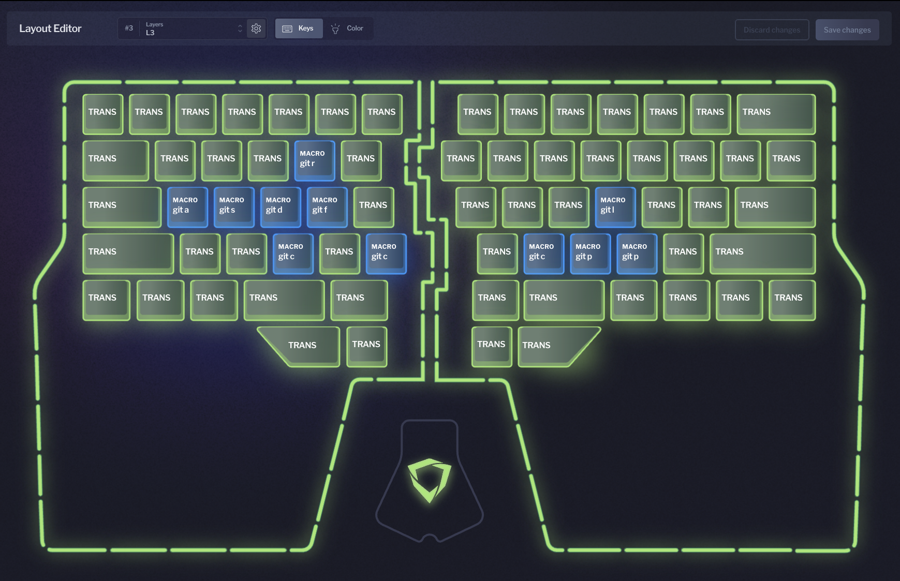

# dygmaconfig

My [Dygma](https://dygma.com) Raise keyboard layers are set up as follows:

| Layer 3 key | Macro |
| --- | --- |
| c   | `git clone `|
| b   | `git checkout -b ` |
| m   | `git checkout main` |
| <   | `git pull` |
| >   | `git push ` |
| a   | `git add --all && git commit -m "` |
| s   | `git status` |
| d   | `git diff ` |
| f   | `git fetch` |
| l   | `git log --name-status` |
| r   | `git rebase main` |

## To do

- Beautify colors
- Upload my Bazecor config here
